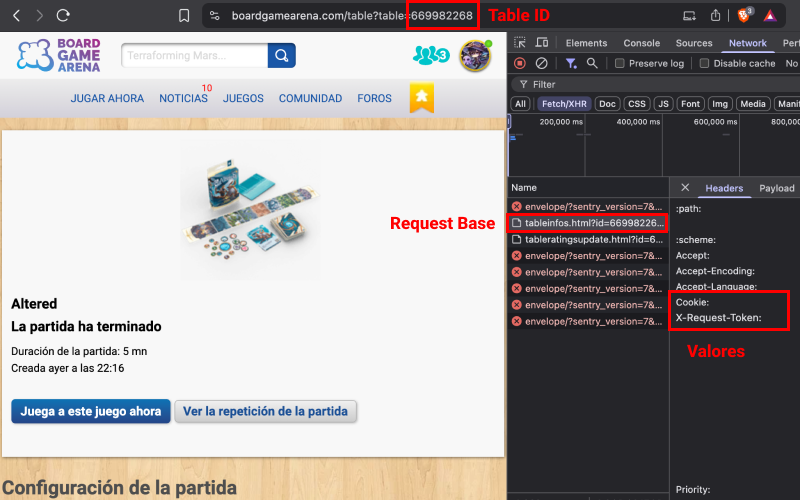

# Altered BGA Decks

This repository contains a script that uses the cookie and request token obtained from Board Game Arena (BGA) to retrieve the decks of participants at a specific Altered table.

## Requirements

- Node.js (>= 20.0.0)

## How to Use

1.- Clone the repository

2.- Install dependencies
```bash
yarn
```

3.- Create a `.env` file in the root directory of the project and add your BGA cookie and request token:

```env
COOKIE=<your-cookie>
X_REQUEST_TOKEN=<your-request-token>
```

- `COOKIE`: Your BGA cookie. You can find it in your browser's developer tools. Use the screenshot below as a reference.
- `X_REQUEST_TOKEN`: Your BGA request token. You can find it in your browser's developer tools. Use the screenshot below as a reference.
3.- Run the script

```bash
yarn start <table-id>
```

Replace `<table-id>` with the ID of the Altered table you want to retrieve decks from.


